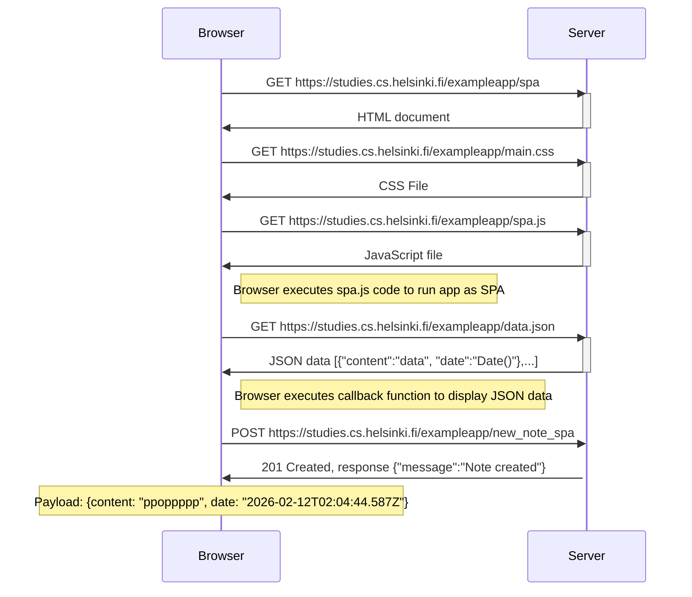

```mermaid
sequenceDiagram
    participant Browser
    participant Server

    Browser->>Server: GET https://studies.cs.helsinki.fi/exampleapp/spa
    activate Server
    Server->>Browser: HTML document
    deactivate Server


    Browser->>Server:GET https://studies.cs.helsinki.fi/exampleapp/main.css
    activate Server
    Server->>Browser: CSS File
    deactivate Server

    Browser->>Server: GET https://studies.cs.helsinki.fi/exampleapp/spa.js
    activate Server
    Server->>Browser: JavaScript file
    deactivate Server

    Note right of Browser: Browser executes spa.js code to run app as SPA

    Browser->>Server: GET https://studies.cs.helsinki.fi/exampleapp/data.json
    activate Server
    Server->>Browser: JSON data [{"content":"data", "date":"Date()"},...]
    deactivate Server

    Note right of Browser: Browser executes callback function to display JSON data

    Browser->>Server: POST https://studies.cs.helsinki.fi/exampleapp/new_note_spa
    activate Server
    Server->>Browser: 201 Created, response {"message":"Note created"}

    Note over Browser: Payload: {content: "ppoppppp", date: "2026-02-12T02:04:44.587Z"}
```