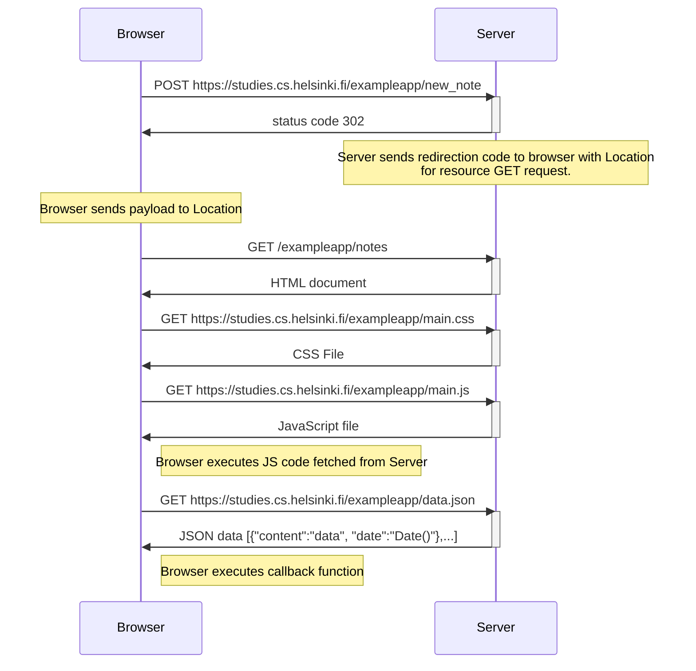

```mermaid
sequenceDiagram
    participant Browser
    participant Server

    Browser->>Server: POST https://studies.cs.helsinki.fi/exampleapp/new_note
    activate Server
    Server->>Browser: status code 302
    deactivate Server

    Note over Server: Server sends redirection code to browser with Location <br/> for resource GET request.

    Note over Browser: Browser sends payload to Location
    Browser->>Server: GET /exampleapp/notes
    activate Server
    Server->>Browser: HTML document
    deactivate Server


    Browser->>Server:GET https://studies.cs.helsinki.fi/exampleapp/main.css
    activate Server
    Server->>Browser: CSS File
    deactivate Server

    Browser->>Server: GET https://studies.cs.helsinki.fi/exampleapp/main.js
    activate Server
    Server->>Browser: JavaScript file
    deactivate Server

    Note right of Browser: Browser executes JS code fetched from Server

    Browser->>Server: GET https://studies.cs.helsinki.fi/exampleapp/data.json
    activate Server
    Server->>Browser: JSON data [{"content":"data", "date":"Date()"},...]
    deactivate Server

    Note right of Browser: Browser executes callback function
```